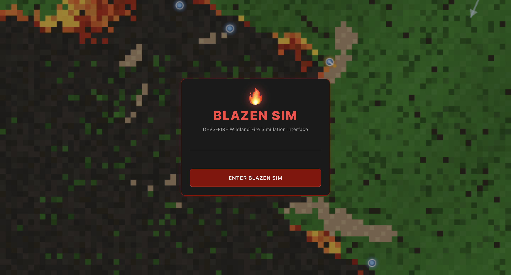
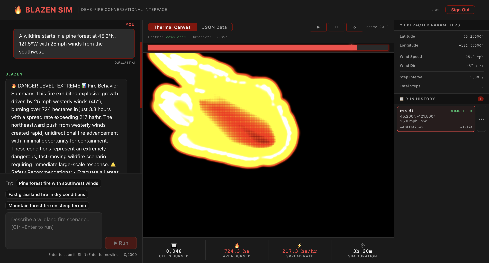

# Blazen Sim

A full-stack web application providing a conversational interface for wildland fire simulation using the DEVS-FIRE model. Users can describe fire scenarios in natural language, and the system extracts simulation parameters via Claude AI, runs the DEVS-FIRE simulation, and visualizes the thermal output.

## Screenshots




## Features

- **Conversational Interface**: Describe fire scenarios in natural language
- **AI-Powered Parameter Extraction**: Claude AI extracts simulation parameters from natural language
- **Real-time Visualization**: Interactive canvas-based thermal output visualization
- **Simulation History**: Track and compare multiple simulation runs
- **Wildfire Background**: Live cellular automata wildfire simulation on the auth gateway
- **Suggested Prompts**: Quick-start prompts for common fire scenarios

## Tech Stack

### Backend
- Express.js (HTTP server)
- TypeScript
- @anthropic-ai/sdk (Claude AI integration)
- CORS, dotenv

### Frontend
- React 18
- Vite (build tool)
- TypeScript
- Custom CSS styling

### Database
- PostgreSQL
- pgcrypto extension for UUID generation

## Project Structure

```
blazen-sim/
├── backend/
│   ├── src/
│   │   ├── controllers/
│   │   │   └── SimulationController.ts
│   │   ├── services/
│   │   │   ├── ClaudeAgentService.ts
│   │   │   └── DevsFireClient.ts
│   │   ├── middleware/
│   │   │   └── RateLimiter.ts
│   │   └── server.ts
│   ├── package.json
│   └── tsconfig.json
├── frontend/
│   ├── src/
│   │   ├── components/
│   │   │   ├── AuthGateway.tsx
│   │   │   ├── ChatInterface.tsx
│   │   │   ├── VisualizationPanel.tsx
│   │   │   ├── FireStatsPanel.tsx
│   │   │   ├── SimInfoSidebar.tsx
│   │   │   └── WildfireBackground.tsx
│   │   ├── engine/
│   │   │   └── ThermalRenderer.ts
│   │   ├── App.tsx
│   │   └── main.tsx
│   ├── package.json
│   └── vite.config.ts
├── database/
│   └── schema.sql
└── README.md
```

## Setup Instructions

### Prerequisites
- Node.js (v18 or higher)
- PostgreSQL
- Anthropic API key
- DEVS-FIRE API credentials

### Backend Setup

1. Navigate to the backend directory:
```bash
cd backend
```

2. Install dependencies:
```bash
npm install
```

3. Create environment file:
```bash
cp .env.example .env
```

4. Fill in your API credentials in `.env`:
```
ANTHROPIC_API_KEY=your_anthropic_api_key
DEVS_FIRE_EMAIL=your_email
DEVS_FIRE_PASSWORD=your_password
```

5. Start the backend server:
```bash
npm run dev
```
Backend runs on http://localhost:4000

### Frontend Setup

1. Navigate to the frontend directory:
```bash
cd frontend
```

2. Install dependencies:
```bash
npm install
```

3. Start the frontend dev server:
```bash
npm run dev
```
Frontend runs on http://localhost:5173

### Database Setup

1. Create a PostgreSQL database
2. Run the schema:
```bash
psql -U your_user -d your_database -f database/schema.sql
```

## API Endpoints

### POST /api/v1/simulation/run
Main simulation endpoint that:
- Accepts natural language prompts
- Extracts simulation parameters via Claude
- Runs DEVS-FIRE simulation
- Returns thermal grid data and results

Request body:
```json
{
  "prompt": "A wildfire starts in a pine forest at 45.2°N, 121.5°W with 15mph winds from the southwest.",
  "simulationContext": "Optional context from previous runs"
}
```

## Usage

1. Open the application in your browser
2. Click "Enter Blazen Sim" to access the main interface
3. Either:
   - Type a fire scenario description in the chat
   - Click one of the suggested prompts
4. The system will:
   - Extract parameters via Claude AI
   - Run the DEVS-FIRE simulation
   - Display the thermal output visualization
5. View simulation history and compare runs in the sidebar

## Security Notes

- Never commit `.env` files to version control
- API keys are stored in environment variables
- Rate limiting is implemented for API endpoints
- CORS is configured for allowed origins

## License

This project is for educational purposes.

## Acknowledgments

- DEVS-FIRE simulation model
- Anthropic Claude AI
- React and Vite communities
